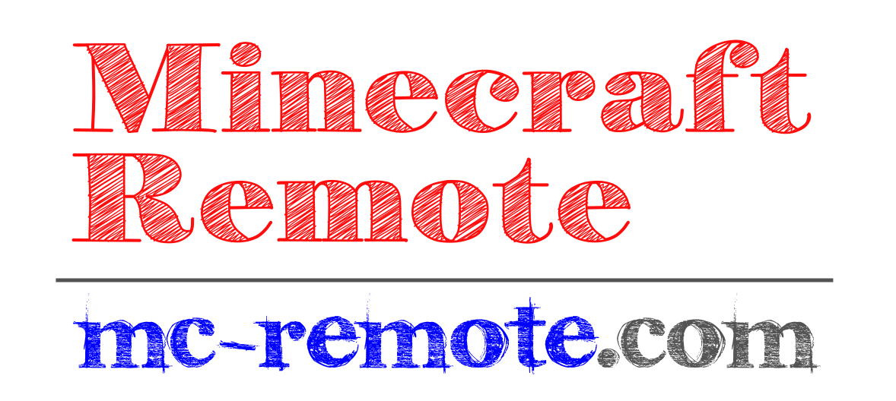

# Minecraft Remote Project "Repository Hub"

Followings are the links to the repositories of the project.

- Paper plugin for Minecraft Server [McRemote](https://github.com/Naohiro2g/McRemote)
- API/Client in Python [minecraft-remote-api](https://github.com/Naohiro2g/minecraft-remote-api)
- Sample codes in Python [mc_remote_samples](https://github.com/Naohiro2g/mc_remote_samples)

For more information, please visit us at [```mc-remote.com```](https://mc-remote.com) which is the Official Information Center of the Minecraft Remote Project.

[](https://mc-remote.com)

---




# About the Minecraft Remote Project

Minecraft Remote (or mc-remote) is a remote control system for Minecraft. The client communicates with a dedicated server provided by [the McRemote plugin](https://github.com/Naohiro2g/McRemote/)—which runs alongside your PaperMC server—while the API facilitates user interaction, allowing users to write code and perform automatic construction.

---

Copyright &copy; Code2CreateClub All Rights Reserved.
